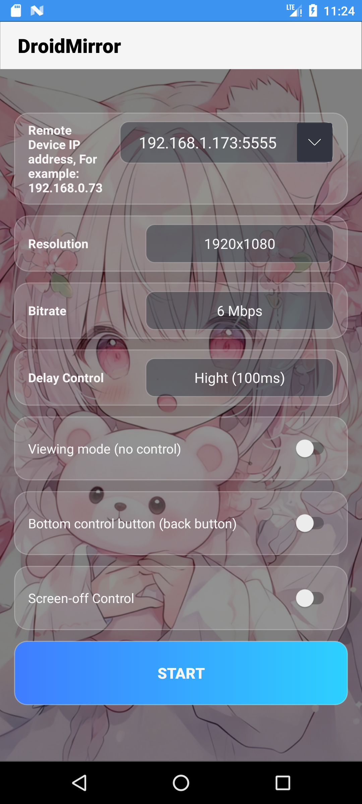

# DroidMirror

- This application is rebuilt based on [**ScrcpyForAndroid**](https://github.com/zwc456baby/ScrcpyForAndroid) and [**Scrcpy**](https://github.com/Genymobile/scrcpy).

- This application mirrors display and touch controls from a remote android device to android device.

- Scrcpy for Android uses ADB-Connect interface to connect to android device to be mirrored.

- Screen-off Control .

- Audio forwarding toggle.

- Auto-reconnect when returning to foreground after background/screen-off.

## Download

[scrcpy-release.apk](https://github.com/rssqbjn/ScrcpyForAndroid/releases)

## Instructions to use

- Make sure both devices are on same local network.
- Enable **ADB-connect/ADB-wireless/ADB over network** on the device to be mirrored. 
- Open scrcpy-android app and enter ip address of device to be mirrored.
- Select display parameters and bitrate from drop-down menu(1280x720 and 2Mbps works best).
- Set **Navbar** switch if the device to be mirrored has only hardware navigation buttons.
- Hit **start** button.
- Accept and trust(check always allow from this computer) the ADB connection prompt on target device(Some custom roms don't have this prompt).
- Thats all! You should be seeing the screen of remote android device.
- To wake up the remote device, **double tap anywhere on screen**.
- To put the remote device to sleep, **close proxmity sensor and double tap anywhere on the screen**. 
- To bring back the local android system navbar while mirroring the remote device, **swipe up from the bottom edge of screen**.

## Connecting to public network devices

>  The public network port of the device needs to be open for access

### Connection Example

- 192.168.1.222

- host.example.com:5555

- \[2000:2000:2000:2000::2000]:5555

## Code Reference

- [ScrcpyForAndroid](https://github.com/zwc456baby/ScrcpyForAndroid)
- [scrcpy-android](https://gitlab.com/las2mile/scrcpy-android)
- [scrcpy](https://github.com/Genymobile/scrcpy)